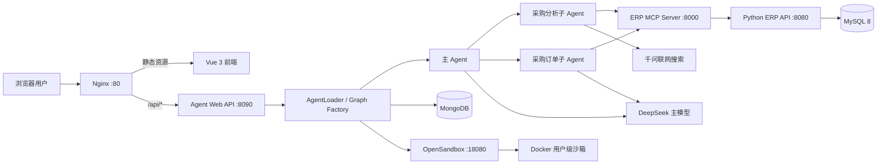
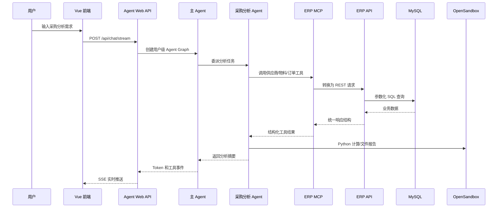
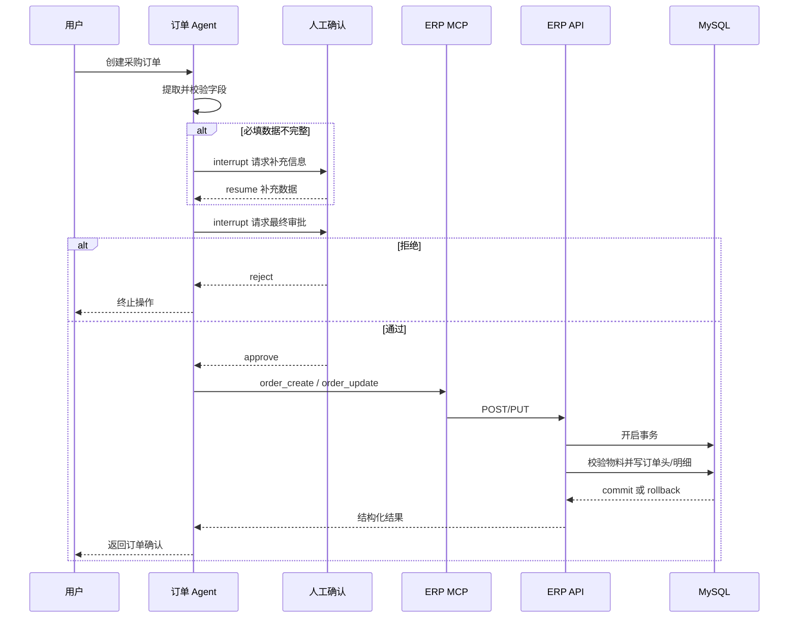

# ERP 智能采购助手项目说明书（面试讲解版）

> 文档依据当前仓库代码编写。目标不是堆砌技术名词，而是帮助你向面试官讲清楚：项目解决什么问题、为什么这样设计、核心链路如何运行、你做了哪些工程化工作、目前还有哪些边界。

## 1. 一句话介绍

这是一个面向摩托车零配件采购场景的 AI ERP 助手。用户可以用自然语言查询供应商、零部件、库存和采购历史，也可以让系统完成采购分析、生成报告、创建或修改订单。系统采用 Vue 3 + FastAPI + DeepAgents/LangGraph + MCP + MySQL + MongoDB + OpenSandbox 构建，并通过人工审批、用户级沙箱隔离、状态持久化和故障恢复机制控制智能体执行风险。

面试时可以先用这句话定调：

> 我做的不是一个只会聊天的机器人，而是把大模型接入真实 ERP 数据和业务操作的智能采购工作台。它既能查数据、做分析，也能执行订单写操作，但所有高风险操作都必须经过人工确认。

## 2. 项目背景与业务价值

传统 ERP 的采购流程通常存在三个问题：

1. 数据入口分散。供应商、物料、库存和订单数据需要在多个页面之间切换查询。
2. 分析门槛较高。供应商比价、库存风险和历史采购趋势往往依赖人工导出数据后再处理。
3. 自动化风险难控制。大模型可以生成参数，但不能让它未经确认直接修改采购订单。

本项目将这些问题拆成三个层次：

- 信息查询：自然语言转换为结构化 ERP 查询。
- 采购分析：组合 ERP 数据、联网资料和沙箱计算，输出分析结论或报告。
- 业务执行：创建、修改采购订单，并通过 Human-in-the-Loop 控制写操作。

项目的核心价值不是“接入了大模型”，而是建立了一条从自然语言到业务数据、再到受控业务操作的完整链路。

## 3. 当前已实现的业务能力

### 3.1 ERP 查询能力

- 按名称模糊查询供应商。
- 分页、按分类、按供应商查询零部件。
- 按名称搜索零部件。
- 查询供应商关联的零部件。
- 查询低于安全库存的库存预警。
- 按零部件和日期范围查询采购订单明细。

### 3.2 ERP 写操作

- 创建采购订单。
- 更新订单状态、交期、备注、金额和订单明细。
- 自动生成订单编号和订单时间。
- 使用事务保证订单头与订单明细同时成功或同时回滚。
- 订单明细变更时重新计算总金额。

### 3.3 智能体能力

- 主 Agent 根据意图把任务委派给采购分析 Agent 或订单 Agent。
- 采购分析 Agent 可组合 ERP 工具、千问联网搜索和沙箱 Python 环境完成分析。
- 订单 Agent 会先校验数据完整性，再请求用户补充缺失字段。
- 创建或更新订单前触发人工审批。
- 自动压缩长对话，避免上下文无限增长。
- 自动提取近期供应商和采购需求，形成用户偏好记忆。
- 工具调用过程通过 SSE 实时推送到前端。

### 3.4 前端交互

- 流式显示模型回复。
- 展示工具调用名称、参数、执行状态和结果。
- 展示主 Agent 与子 Agent 的消息来源。
- 支持停止生成。
- 支持会话列表、历史消息和会话删除。
- 支持订单信息补充和人工审批两类中断交互。
- 支持 Markdown、代码高亮和工具生成图片展示。

## 4. 技术栈

| 层次 | 技术 | 主要职责 |
|---|---|---|
| Web 前端 | Vue 3、Vite、Fetch、Markdown-It、Highlight.js | 对话、SSE 流解析、工具过程展示、HITL 交互 |
| Web API | FastAPI、Uvicorn | 对话接口、历史接口、SSE 输出、Agent 生命周期 |
| Agent 编排 | DeepAgents、LangGraph、LangChain | 主/子 Agent、工具调用、中间件、状态图、人工中断 |
| 业务工具协议 | FastMCP、Streamable HTTP | 将 ERP REST API 封装成大模型可调用工具 |
| ERP 后端 | FastAPI、Pydantic、PyMySQL | 业务校验、数据访问、事务和统一响应协议 |
| 业务数据库 | MySQL 8 | 供应商、零部件、库存、采购订单及明细 |
| Agent 状态 | MongoDB、MongoDBSaver | Checkpoint、会话展示消息、沙箱注册信息 |
| 执行环境 | OpenSandbox、Docker | 用户级隔离的 Python/Shell/文件分析环境 |
| 模型服务 | DeepSeek、千问 OpenAI-compatible API | 主推理、摘要、联网搜索；千问备用模型已配置但自动切换尚未接入 |
| 部署 | Linux、systemd、Nginx | 服务守护、静态资源、反向代理、SSE 代理 |

## 5. 总体架构



### 5.1 为什么拆成三层后端

项目后端没有把所有逻辑塞进一个 FastAPI 进程，而是拆成：

1. Agent Web API：面向前端，负责对话流、会话状态和智能体生命周期。
2. ERP MCP Server：把业务接口转换成带 Schema 和描述的 Agent 工具。
3. Python ERP API：面向业务数据，负责参数校验、SQL 和事务。

这样拆分的价值是：

- Agent 不直接拼 SQL，降低越权和数据破坏风险。
- ERP API 仍然可以被普通 Web、移动端或其他系统复用。
- MCP 层承担“业务接口到大模型工具”的适配职责。
- 将来 ERP 后端替换成 Java、Python 或远程 SaaS 时，Agent 工具协议可以保持稳定。

这实际上是一个轻量的防腐层设计：上层智能体依赖稳定的 MCP 工具语义，而不是依赖某个具体后端实现。

## 6. 核心请求链路

### 6.1 查询与分析链路



面试讲解重点：模型不是直接访问数据库，而是通过有边界的 MCP 工具查询数据；复杂计算和文件生成放在隔离沙箱中完成。

### 6.2 订单创建链路



这里体现了两层人工控制：

- 信息不足时暂停，让用户补齐数据。
- 数据完整后仍暂停，让用户确认真正的写操作。

这个设计比简单的“让模型自己决定是否下单”更符合企业系统的审计和风险控制要求。

## 7. 多 Agent 设计思路

项目采用“主 Agent 负责路由，专业子 Agent 负责执行”的结构。

### 7.1 主 Agent

主 Agent 负责：

- 理解用户意图。
- 判断是采购分析还是订单操作。
- 委派任务并整合最终结果。
- 管理上下文、记忆、沙箱和通用工具。

它不直接持有全部 ERP 工具，目的是减少工具数量对模型决策的干扰，并让权限边界更清晰。

### 7.2 采购分析 Agent

负责供应商比价、库存分析、历史采购分析和外部市场调研。它拥有查询类 ERP 工具、联网搜索和分析技能，但不应该直接执行高风险订单写操作。

### 7.3 采购订单 Agent

负责订单创建、更新和查询。它有独立的字段校验流程、数据补充工具和 `interrupt_on` 审批配置。

### 7.4 为什么使用 YAML 配置子 Agent

子 Agent 的名称、描述、工具、技能、提示词和审批策略放在 YAML 中，而不是全部硬编码。好处是：

- 业务专家可以独立调整提示词和流程。
- 新增子 Agent 时不需要改主编排代码。
- 工具通过名称在运行时解析，便于扩展。
- 不同 Agent 可以配置不同的调用限制和摘要策略。

## 8. 项目亮点与设计取舍

### 8.1 MCP 解耦 ERP 与智能体

项目提供 8 个 ERP MCP 工具，覆盖供应商、零部件、库存和订单。MCP 层负责：

- 给工具提供明确的参数 Schema 和业务说明。
- 将模型调用转换成标准 REST 请求。
- 屏蔽 ERP 后端语言和部署位置。
- 统一处理 API 返回值和异常。

Python ERP API 保留了原有 Java 风格的接口路径、camelCase 字段和 `{code, message, data}` 响应格式，因此迁移后上层 MCP 工具不需要大改。这是接口兼容迁移的一个亮点。

### 8.2 用户级沙箱隔离

复杂分析、Shell 命令和文件生成不会直接在 Agent Web 服务宿主机执行，而是在 OpenSandbox 管理的 Docker 沙箱中运行。

当前策略是：

- 每个 `user_id` 对应一个独立沙箱。
- 同一用户的多个会话共享沙箱，避免反复初始化。
- 沙箱 ID 注册到 MongoDB。
- 启动时预热一个沙箱，首个用户可以直接认领。
- 后台异步补充新的预热沙箱。
- 沙箱失效时通过稳定代理对象热替换后端。

`SandboxBackendProxy` 的关键价值是保持对象引用不变。中间件和工具持有的仍是同一个代理对象，底层沙箱重建后只替换内部 backend，不需要重建所有依赖对象。

### 8.3 主动恢复与熔断组合

沙箱可靠性不是简单地“失败后重试”，而是两层保护：

- `SandboxHealthMiddleware`：每次 Agent 运行前主动 ping，失败则重建并重新播种文件。
- `SandboxCircuitBreakerMiddleware`：连续出现沙箱错误时终止运行，避免无限重建和模型循环。

这种组合对应常见的可靠性设计：先自愈，自愈失败再熔断。

### 8.4 工具异常不拖垮整个 Agent

`ToolErrorMiddleware` 会把工具异常转换为带 `status="error"` 的 ToolMessage，让模型可以调整参数、换工具或向用户解释问题，而不是让整次图运行直接崩溃。

外部分析 MCP 也被设计成可选依赖：未配置或远端失效时只禁用外部图表工具，ERP 核心能力仍可启动。

### 8.5 Human-in-the-Loop 控制写操作

订单操作使用两类中断：

- `request_order_info`：缺少物料、数量、单价等信息时暂停。
- `interrupt_on`：调用 `order_create` 或 `order_update` 前要求 approve/reject。

中断状态由 LangGraph checkpoint 保存，前端通过 resume 接口恢复，而不是重新执行整段对话。

### 8.6 分层记忆

项目把不同类型的数据放到不同存储中：

| 数据 | 当前存储 | 目的 |
|---|---|---|
| 业务主数据 | MySQL | 强一致业务查询和事务写入 |
| Agent checkpoint | MongoDB | 对话状态、工具状态、HITL 中断恢复 |
| 前端展示消息 | MongoDB | 保留主/子 Agent 和工具消息的完整展示顺序 |
| 沙箱注册 | MongoDB | user_id 与 sandbox_id 映射 |
| 用户偏好和动态技能 | InMemoryStore | 通过 CompositeBackend 提供文件式访问；当前仍是开发态实现 |

这里不能把 InMemoryStore 讲成真正的生产持久化。当前代码注释也明确指出，生产环境应替换成持久化 Store。

### 8.7 技能系统与渐进式披露

采购分析流程、图表参数和网页抓取能力被组织为 Skill 文件。Agent 先读取简短目录，再按任务需要加载具体 `SKILL.md`，避免把所有操作手册一次性塞进系统提示词。

技能有两类来源：

- 项目预置技能：启动或运行前从 `src/skills` 同步到沙箱。
- 动态技能：可在沙箱中验证后分配给指定 Agent，并写入 StoreBackend。

### 8.8 长上下文治理

项目使用专门的摘要模型处理上下文压缩和记忆提取，不让主推理模型承担所有工作：

- 上下文接近阈值时自动摘要。
- Agent 也可以主动调用 `compact_conversation`。
- 完整历史可写入文件系统，当前上下文只保留摘要。
- 主 Agent 与分析 Agent 分别设置模型调用和工具调用上限。

### 8.9 SSE 流式可观测交互

后端不是只返回最终文本，而是把执行过程拆成事件：

- `token`
- `tool_start`
- `tool_args`
- `tool_result`
- `tool_end`
- `interrupt`
- `done`
- `error`

前端用 `fetch + ReadableStream` 处理 POST SSE，并用工具栈支持主 Agent 委派子 Agent 后的嵌套工具调用。用户可以看到系统正在查什么、参数是什么、结果是否成功，这比黑盒式聊天更适合企业业务场景。

### 8.10 ERP 事务与兼容性

订单创建和明细写入在同一事务中执行：

- 先校验所有 `partId` 是否有效。
- 写入订单头。
- 批量写入订单明细。
- 任一步失败则回滚。

订单更新只修改用户明确提供的字段；如果替换订单明细而没有显式给总金额，则重新计算总金额。API 通过 Pydantic 约束状态范围、金额精度、必填明细和日期格式。

## 9. 数据模型与接口规模

SQL 初始化文件包含 8 张业务表：

- `supplier`
- `part`
- `inventory`
- `purchase_order`
- `order_detail`
- `customer`
- `logistics`
- `user`

当前示例数据包括：

- 33 个供应商。
- 67 个零部件。
- 67 条库存记录。
- 182 个采购订单。
- 631 条订单明细。

Python ERP API 当前提供 9 个主要接口，包括健康检查、供应商查询、零部件查询、库存预警、订单创建、订单更新和历史明细查询。

## 10. 前端设计

前端没有使用 EventSource，因为原生 EventSource 只适合 GET，而聊天请求需要 POST 请求体。项目采用 `fetch + ReadableStream + TextDecoder` 手动解析 SSE。

前端重点状态包括：

- 当前 `thread_id`。
- 消息列表。
- 流式生成状态。
- 工具调用栈。
- 当前中断数据。
- AbortController。

工具消息与普通回复按时间混合展示，能够呈现“主 Agent 思考后的文本 → 子 Agent 工具调用 → 工具结果 → 最终总结”的完整过程。

## 11. 模型策略

当前代码中的角色划分是：

- 主模型：DeepSeek，负责复杂推理和任务编排。
- 摘要模型：DeepSeek 低温度模型，负责对话压缩和记忆抽取。
- 联网搜索：千问，通过百炼 OpenAI-compatible API 使用搜索增强。
- 备用模型：千问模型实例已经配置，但当前还没有接入自动故障切换链路。

面试时不要说“已经实现模型自动容灾”。准确说法是：

> 我把主模型、摘要模型和备用模型的配置拆开了，联网搜索也独立使用千问。目前备用模型对象已经配置，下一步会在模型调用层加入可观测的 fallback 策略和熔断条件。

## 12. 部署架构

当前采用单台 Linux 云服务器部署，服务只在必要边界开放：

| 端口 | 服务 | 暴露范围 |
|---|---|---|
| 80 | Nginx | 公网 |
| 8000 | ERP MCP | 127.0.0.1 |
| 8080 | ERP API | 127.0.0.1 |
| 8090 | Agent Web API | 127.0.0.1 |
| 18080 | OpenSandbox | 127.0.0.1 |
| 27017 | MongoDB | 127.0.0.1 |
| 3306 | MySQL | 127.0.0.1 |

Nginx 负责：

- 托管 `frontend/dist` 静态文件。
- 将 `/api/*` 转发给 Agent Web API。
- 关闭代理缓冲，以支持 SSE 实时输出。
- 设置较长读超时，以允许 Agent 完成长任务。

三个 Python 服务分别由 systemd 守护：

- `erp-api.service`
- `erp-mcp.service`
- `agent-web.service`

依赖顺序是：

```text
MySQL → ERP API → ERP MCP → Agent Web
MongoDB + Docker/OpenSandbox ─────────┘
```

## 13. 工程验证情况

本次文档编写前进行了以下本地验证：

- Python ERP API 合约测试：8 个测试全部通过。
- 前端生产构建：Vite 构建成功。
- 前端构建存在一个优化提示：主 JS 包约 1.12 MB，后续应做路由/组件动态加载和 vendor 分包。
- 云端已经验证 ERP API、ERP MCP、Agent Web 和 Nginx 的健康链路。

当前测试侧重 ERP API 契约，尚缺少：

- MySQL 真实事务集成测试。
- MCP 到 ERP API 的端到端测试。
- SSE 事件顺序测试。
- HITL 中断与恢复测试。
- OpenSandbox 重建和熔断测试。
- 多用户并发与资源压力测试。

## 14. 如何向面试官讲项目

### 14.1 30 秒版本

> 这是一个智能采购 ERP 助手。前端用 Vue 展示流式对话和工具执行过程，后端用 DeepAgents/LangGraph 编排主 Agent、采购分析 Agent 和订单 Agent。Agent 不直接访问数据库，而是通过 MCP 调用 Python ERP API，业务数据落在 MySQL，对话状态落在 MongoDB，复杂分析放在每用户独立的 OpenSandbox 中执行。订单创建和修改加入了信息补充与最终审批两层人工介入，避免模型直接执行高风险操作。

### 14.2 3 分钟版本

建议按以下顺序讲：

1. 业务问题：采购人员查数据、做分析、下单需要跨多个页面。
2. 产品目标：让用户通过自然语言完成查询、分析和受控订单操作。
3. 架构分层：Vue → Agent Web → 多 Agent → MCP → ERP API → MySQL。
4. 两个核心亮点：MCP 解耦和订单 HITL。
5. 工程亮点：用户级沙箱、自动恢复与熔断、MongoDB checkpoint、SSE 工具过程展示。
6. 真实边界：目前缺少登录鉴权、持久 Store 和完整集成测试，下一步优先补齐。

### 14.3 10 分钟版本

可以使用下面的节奏：

- 第 1 分钟：业务背景和目标。
- 第 2～3 分钟：总体架构和服务职责。
- 第 4～5 分钟：采购分析链路。
- 第 6～7 分钟：订单写操作与 HITL。
- 第 8 分钟：沙箱隔离、恢复和熔断。
- 第 9 分钟：部署、数据存储和测试。
- 第 10 分钟：当前不足和演进路线。

## 15. 推荐演示脚本

面试演示不要一开始就演示最复杂的订单创建。按风险从低到高：

1. 健康检查：证明 Web、Agent、MCP、ERP API 都在线。
2. 简单查询：“查询博世供应商及其零部件”。
3. 分析任务：“分析火花塞历史采购价格和供应商情况，给出采购建议”。
4. 展示工具调用过程和子 Agent 来源。
5. 订单任务：故意缺少数量或单价，展示信息补充中断。
6. 补齐数据后展示最终审批。
7. 拒绝一次，证明模型不能绕过审批写库。
8. 再发起并批准，最后查询订单验证数据落库。

## 16. 面试高频追问与参考回答

### 为什么不让 Agent 直接访问 MySQL？

直接访问数据库会扩大模型权限，也难以约束 SQL 范围。项目通过 ERP API 固化业务校验和事务，再通过 MCP 暴露有限工具，让模型只能执行明确允许的操作。

### 为什么需要 MCP，直接调用 REST 不行吗？

REST 是服务间接口，MCP 是面向 Agent 的工具协议。MCP 为模型提供工具名称、参数 Schema 和业务描述，同时隔离底层 ERP 实现。REST 仍然保留，供普通应用复用。

### 为什么要拆成多个 Agent？

采购分析和订单操作的目标、工具和风险不同。拆分后可以缩小每个 Agent 的工具空间，并给订单 Agent 单独配置审批、调用限制和提示词，降低错误调用概率。

### 如何防止模型误下单？

一是订单 Agent 先做字段完整性校验；二是缺少信息时触发 interrupt；三是创建和更新工具配置 `interrupt_on`，只有用户明确 approve 后才执行；四是 ERP API 仍会做 Schema 和事务校验。

### 如何支持多用户？

请求携带 `user_id`，Agent Graph 按用户获取沙箱；同一用户共享沙箱，不同用户使用不同 Docker 沙箱。MongoDB 保存 checkpoint 和沙箱映射，CompositeBackend 按用户 namespace 路由记忆文件。

### 沙箱挂了怎么办？

运行前健康检查会自动重建沙箱，代理对象热替换底层 backend，其他工具不需要重建。如果恢复后仍连续失败，熔断中间件终止执行，避免无限循环。

### 如何控制长对话成本？

使用独立摘要模型，在上下文接近阈值时压缩历史；工具返回过大时由 DeepAgents offload 到文件；主 Agent 和子 Agent 都设置模型及工具调用次数上限。

### 为什么同时使用 MySQL 和 MongoDB？

MySQL 管理有事务和关系约束的 ERP 业务数据；MongoDB 保存结构灵活、追加频繁的 Agent checkpoint、展示消息和沙箱注册。两者承担不同的数据一致性需求。

### 为什么 OpenSandbox 要按用户而不是按会话？

按会话隔离最彻底，但创建成本和资源占用较高。当前采用按用户隔离，同一用户多个会话共享已安装的依赖和文件，在隔离性与性能之间做平衡。

## 17. 可以重点讲的三个技术难点

### 难点一：ERP 接口从 Java 思路迁移到 Python但保持上层兼容

处理方式：保留原接口路径、请求字段别名、统一响应格式和业务语义；使用序列化层将 Python snake_case 转换为 camelCase；通过合约测试验证兼容性。

### 难点二：Agent 长任务既要隔离又要具备可恢复性

处理方式：使用 OpenSandbox 隔离执行，以 `user_id` 管理生命周期；MongoDB 保存沙箱 ID；使用预热降低首次等待；通过代理对象支持重建后的热替换；最后增加熔断避免恢复循环。

### 难点三：订单操作不能因为模型“认为正确”就直接执行

处理方式：把信息补充和最终审批建模为 LangGraph 中断；中断状态写入 checkpoint；前端收到 interrupt 事件后显示专用 UI，再通过 resume 恢复原图执行。

## 18. 当前不足与演进路线

这一部分面试时要主动、诚实地讲，体现工程判断力。

### P0：生产安全

- 当前网页和 `/api/*` 尚未实现登录鉴权，`user_id` 由客户端输入，不能作为可信身份。
- 目前使用 HTTP，应配置域名和 HTTPS。
- CORS 当前允许所有来源，生产环境应限制域名。
- 应增加 RBAC、操作审计、API 限流和订单幂等键。

### P0：用户身份链路修复

后端的聊天和恢复模型虽然支持 `user_id`，但前端请求目前没有发送该字段，因此会回落到 `laoxiao` 默认值；历史接口也没有按用户过滤。正式项目应由登录态/JWT 在服务端解析可信用户身份，并对会话查询、读取、删除和恢复统一校验资源归属。

### P1：持久化和高可用

- 将 `InMemoryStore` 替换为 MongoDB、Redis 或数据库支持的持久 Store。
- 明确沙箱在优雅关闭和异常重启两种情况下的保留策略。
- 多实例部署时，将进程内沙箱缓存和锁迁移到共享协调层。
- 为订单写操作增加幂等性，防止网络重试造成重复订单。

### P1：模型容灾

- 当前千问备用模型只完成配置，尚未接入自动 fallback。
- 应定义可重试错误、不可重试错误、超时和熔断策略。
- 对 fallback 次数、成本、延迟和成功率增加指标。

### P1：可观测性

- 引入结构化日志和 request/thread/user 关联 ID。
- 增加模型耗时、Token、工具成功率、沙箱创建耗时等指标。
- 接入链路追踪或 LangSmith 类工具。
- 对日志中的工具参数和业务数据进行脱敏。

### P2：性能和测试

- 前端主包需要代码分割。
- 沙箱基础镜像可以预装常用 Python 依赖，减少首次启动时间。
- 补齐 MCP、SSE、HITL、沙箱和多用户并发测试。
- 当前根 README 仍是 LangGraph 模板内容，应替换成项目真实说明。

### P2：可选分析 MCP

外部分析 MCP 当前通过 `ANALYSIS_MCP_URL` 可选配置。没有有效地址时图表工具会降级关闭，但 ERP 查询、订单和本地分析仍可运行。后续可以替换成自建可视化工具，消除外部服务失效风险。

## 19. 简历项目描述模板

可以根据自己的真实参与程度调整，不要把没有亲自完成的内容写成个人成果。

> **智能采购 ERP 助手｜Python / FastAPI / LangGraph / MCP / Vue 3**  
> 面向零配件采购场景设计并实现多智能体 ERP 助手，支持供应商、零部件、库存和采购订单的自然语言查询与受控写操作。通过 MCP 解耦 Agent 与 ERP API，并保持原 Java 风格接口契约，实现 Python 后端替换；基于 LangGraph checkpoint 构建订单信息补充与最终审批两级 Human-in-the-Loop；基于 OpenSandbox 实现用户级隔离、预热、自愈和熔断；使用 MongoDB 持久化对话状态，MySQL 保证订单事务一致性，Vue 3 通过 SSE 实时展示模型与嵌套工具调用过程。完成 Linux + systemd + Nginx 单机部署。

可选量化信息：

- 封装 8 个 ERP MCP 工具。
- 拆分 2 个专业子 Agent。
- 提供 9 个核心 ERP API。
- ERP API 8 个合约测试通过。
- 支持 8 类 SSE 运行事件和 2 类人工中断。

## 20. 项目目录速查

```text
frontend/                       Vue 3 前端
src/api_view/                   Agent Web API、SSE、会话历史
src/agent/main_agent.py         主 Agent Graph Factory
src/agent/subagents/configs/    子 Agent YAML 配置
src/agent/middlewares/          记忆、恢复、熔断、摘要等中间件
src/agent/backends/             OpenSandbox 生命周期和代理
src/agent/tools/                MCP、搜索、HITL、技能工具
src/mcp_server/                 ERP MCP 服务和 8 个工具
src/erp_backend/                Python ERP API、Schema、事务和 SQL
src/skills/                     采购分析和网页抓取技能
src/test/                       测试及验证脚本
motorparts_db.sql               MySQL 表结构和示例数据
```

## 21. 最后总结

这个项目最适合突出四件事：

1. 不是把大模型套在聊天 UI 上，而是让模型通过受控工具进入真实 ERP 业务链路。
2. 使用 MCP 形成稳定业务工具层，完成后端迁移与 Agent 解耦。
3. 使用 HITL、事务、沙箱、自愈和熔断控制智能体执行风险。
4. 能清楚说明当前系统仍缺少鉴权、HTTPS、持久 Store、模型自动 fallback 和完整集成测试，并给出合理演进顺序。

如果面试官只记住一句话，应该是：

> 这个项目的重点不是让 AI “能操作 ERP”，而是让它在明确权限、可观察过程、人工审批和事务保护下安全地操作 ERP。
